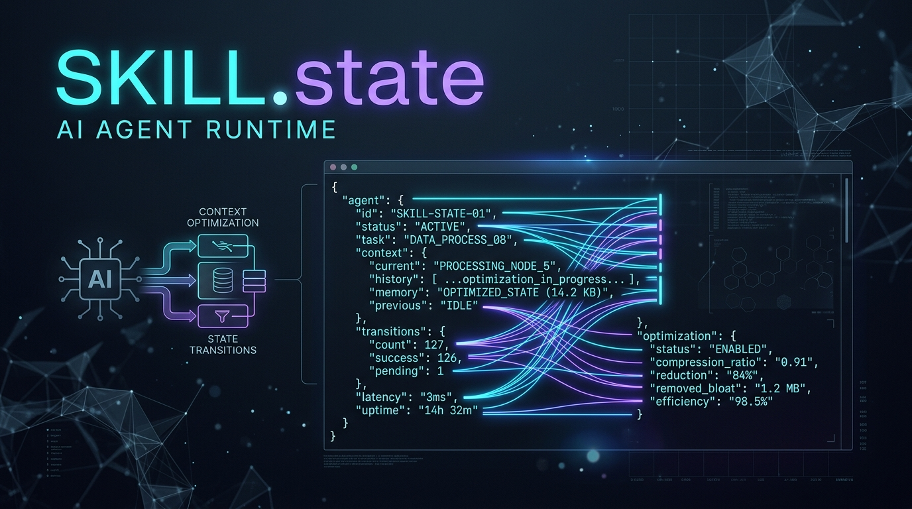

<p align="center">
  
</p>

<p align="center">
  
</p>

<h1 align="center">SKILL.state MCP Runtime</h1>

<p align="center">
  <b>Eliminate context bloat, token rot, and reasoning trace poisoning in AI agents.</b><br/>
  Production-grade Model Context Protocol (MCP) server implementing the formal agent state architecture from <a href="https://arxiv.org/html/2608.26263">arXiv:2608.26263</a>.
</p>

<p align="center">
  <a href="https://www.npmjs.com/package/@bub0lehich/skill-state-mcp-server"></a>
  <a href="https://arxiv.org/html/2608.26263"></a>
  <a href="https://modelcontextprotocol.io"></a>
  <a href="https://github.com/Derzkiyboomchik/skill-state-mcp-server/blob/main/LICENSE"></a>
  <a href="https://nodejs.org"></a>
</p>

---

## ⚡ Quick Start

Run directly via `npx` (zero installation required):

```bash
npx -y @bub0lehich/skill-state-mcp-server
```

When started in an interactive terminal, the server renders a cybernetic ASCII logo and diagnostic startup animation before serving stdio MCP traffic:

```text
  ███████╗██╗  ██╗██╗██╗     ██╗     ███████╗████████╗ █████╗ ████████╗███████╗
  ██╔════╝██║ ██╔╝██║██║     ██║     ██╔════╝╚══██╔══╝██╔══██╗╚══██╔══╝██╔════╝
  ███████╗█████═╝ ██║██║     ██║     ███████╗   ██║   ███████║   ██║   █████╗  
  ╚════██║██╔═██╗ ██║██║     ██║     ╚════██║   ██║   ██╔══██║   ██║   ██╔══╝  
  ███████║██║ ╚██╗██║███████╗███████╗███████║   ██║   ██║  ██║   ██║   ███████╗
  ╚══════╝╚═╝  ╚═╝╚═╝╚══════╝╚══════╝╚══════╝   ╚═╝   ╚═╝  ╚═╝   ╚═╝   ╚══════╝
           Formal State-Based Agent Runtime • arXiv:2608.26263
```

### Add to Claude Desktop

Add this block to your `claude_desktop_config.json` (on macOS: `~/Library/Application Support/Claude/claude_desktop_config.json`, on Windows: `%APPDATA%\Claude\claude_desktop_config.json`):

```json
{
  "mcpServers": {
    "skill-state": {
      "command": "npx",
      "args": ["-y", "@bub0lehich/skill-state-mcp-server"]
    }
  }
}
```

### Add to Cursor (`.cursor/mcp.json`) or Cline / Roo-Code

```json
{
  "mcpServers": {
    "skill-state": {
      "command": "npx",
      "args": ["-y", "@bub0lehich/skill-state-mcp-server"]
    }
  }
}
```

---

## 🧠 Why SKILL.state? (arXiv:2608.26263)

Traditional conversational agents rely on **append-only history** `[m_1, r_1, o_1, m_2, r_2, ...]`. As conversations exceed dozens of turns:
1. **Context Bloat:** Token costs scale linearly with the number of steps $\mathcal{O}(T)$, quickly overflowing context limits.
2. **Reasoning Poisoning:** Stale thoughts ($R_t$) and abandoned hypotheses persist in the context, misleading future reasoning loops.
3. **State Hallucination:** The agent loses track of variables, counters, and completed subtasks buried across thousands of tokens of prose.

### The SKILL.state Paradigm

Instead of maintaining conversational chat history, SKILL.state executes agents against a **compact, strictly typed state tuple** $(P, \Sigma_t, O_t)$:

```
┌──────────────────────────────────────────────────────────────────────────┐
│                     Conventional Agent (Append-Only)                     │
│  [msg1][R1][O1][msg2][R2][O2][msg3]... → context grows forever → rot     │
└──────────────────────────────────────────────────────────────────────────┘
                                      vs.
┌──────────────────────────────────────────────────────────────────────────┐
│                        SKILL.state (This Runtime)                        │
│                                                                          │
│   At step t the LLM receives EXACTLY:      The LLM answers with:         │
│   ┌─────────────────────────────┐          ┌──────────────────────────┐  │
│   │ P   immutable skill spec    │          │ R_t  reasoning (DROPPED) │  │
│   │ Σ_t execution state (JSON)  │   ───▶   │ ΔΣ_t state patch         │  │
│   │ O_t latest observation      │          │ a_t  action              │  │
│   └─────────────────────────────┘          └──────────────────────────┘  │
│                                                                          │
│   Server:  Σ_{t+1} = Σ_t ⊕ ΔΣ_t   →  execute a_t  →  O_{t+1}             │
│   Next turn payload: (P, Σ_{t+1}, O_{t+1})   — no history is kept        │
└──────────────────────────────────────────────────────────────────────────┘
```

| Dimension | Conventional History | SKILL.state Runtime |
|---|---|---|
| **Reasoning Traces ($R_t$)** | Kept forever, causing reasoning loops & bias | **Discarded at the tool boundary**; zero context leakage |
| **Observations ($O_t$)** | Obsolete observations clutter prompt | Only the **latest** $O_t$ is injected |
| **Context Complexity** | $\mathcal{O}(T)$ linear growth (unbounded) | $\mathcal{O}(\|P\| + \|\Sigma\| + \|O\|)$ **constant bounded overhead** |
| **Bookkeeping** | Imprecise natural language scratchpads | **Typed, schema-validated JSON** state $\Sigma_t$ |
| **Rollback on Error** | Erroneous thoughts stay in context | **Transactional atomic rollback** on rejection or schema violation |

---

## 🔄 The $\oplus$ Merge Operator (Null-Deletion Semantics)

At each step $t$, the agent emits a sparse state patch $\Delta\Sigma_t$. The new state is derived by the formal merge operator:

$$\Sigma_{t+1} = \Sigma_t \oplus \Delta\Sigma_t$$

Null is a **first-class deletion instruction**, enabling precise, sparse diffing without destructive overwrites:

| Patch Content in $\Delta\Sigma_t$ | Effect on Target State $\Sigma$ |
|---|---|
| `"key": null` | **Key is completely deleted** from $\Sigma$ |
| `"key": value` (scalar) | Key is updated or inserted |
| `"key": { ... }` | Recursively merged (nested `null` deletes nested fields) |
| `"key": [ ... ]` | Array is replaced wholesale (predictable, deterministic) |
| *(key omitted)* | **Untouched** — patches are sparse and minimal |

### Example

```jsonc
// Current State Σ_t
{
  "order_id": "ORD-9912",
  "phase": "inventory_check",
  "allocated_shelf": "shelf_42",
  "scratchpad": "verifying barcode format..."
}

// Model Patch ΔΣ_t                         // Resulting State Σ_{t+1}
{                                           {
  "phase": "shipping",                        "order_id": "ORD-9912",
  "scratchpad": null,             ⊕   =       "phase": "shipping",
  "tracking_code": "TRK-8821"                 "allocated_shelf": "shelf_42",
}                                             "tracking_code": "TRK-8821"
                                            }
```

---

## 🛠️ MCP Tool Surface

### 1. `initialize_skill`
Initializes a new SKILL.state execution session.
- **Parameters:**
  - `session_id` (`string`, optional): Unique session ID (auto-generated if omitted).
  - `skill_specification` (`string | object`): Immutable prompt / instructions $P$.
  - `initial_state` (`object`): Starting execution state $\Sigma_0$.
  - `state_schema` (`object`, optional): Domain schema for validating $\Sigma_t$.
  - `environment` (`"mock" | "warehouse"`, default `"mock"`): Physical or synthetic executor.
- **Returns:** Boot prompt tuple $(P, \Sigma_0, O_0)$.

### 2. `execute_step`
Executes one formal transition cycle $t \to t+1$.
- **Parameters:**
  - `session_id` (`string`): Target session ID.
  - `reasoning_trace` (`string`): Chain-of-Thought $R_t$ (**automatically discarded**).
  - `state_update` (`object`): Sparse state patch $\Delta\Sigma_t$.
  - `action` (`string | object`): Action $a_t$ dispatched to the executor.
  - `environment_observation` (`string`, optional): Verification check against drift.
- **Transactional Rollback:**
  - If $\Sigma_t \oplus \Delta\Sigma_t$ fails schema validation, the mutation rolls back to $\Sigma_t$ (§3.1, §7).
  - If the environment rejects $a_t$ (e.g. warehouse collision), the state rolls back to $\Sigma_t$ (Appendix B.1).
- **Returns:** Next turn prompt payload $(P, \Sigma_{t+1}, O_{t+1})$.

### 3. `inject_observation`
Simulates external world drift or asynchronous events (arXiv:2608.26263 §5.4 State Recovery).
- **Parameters:**
  - `session_id` (`string`): Target session.
  - `observation` (`string`): New telemetry or asynchronous event $O_{drift}$.
  - `state_patch` (`object`, optional): External state update $\Delta\Sigma_{ext}$.

### 4. `parse_turn_response`
Utility tool to extract $R_t$, $\Delta\Sigma_t$, and $a_t$ from raw fenced ````json blocks when interfacing with standard models (Appendix A.4).

### 5. `close_session`
Concludes a session, frees mutexes, and returns the final execution state snapshot.

---

## 📦 Simulated Environments

### Warehouse Management (`SkillExecBench Environment 1`)
A high-fidelity simulation of the warehouse environment described in arXiv:2608.26263 §4.1:
- **500 independent shelves** (`shelf_0` .. `shelf_499`).
- **Domain commands:**
  - `Store <item> <shelf>`
  - `Ship <item> <shelf>`
  - `Move <item> <source_shelf> <target_shelf>`
  - `Wait` / `Complete`
- **Collision rejection:** Attempting to store an item onto an occupied shelf triggers an environment rejection and rolls back the agent's state patch.
- **Telemetry noise injection:** Injects sensor readings, battery status, and ambient noise to verify agent robustness against observation drift (Experiment 2).

### Mock Environment
Deterministic echo, no-op, synthetic failure, and custom completion actions for testing and domain-agnostic workflows.

---

## 🔍 Inspector Resources (Zero LLM Overhead)

Developers can inspect sessions without polluting the LLM context:
- `skill-state://{session_id}`: Full snapshot of session specification $P$, current state $\Sigma$, step counter, and metadata.
- `skill-state://sessions`: Global registry of all active sessions and lifecycle metrics.

---

## 🚀 HTTP Transport (SSE / Streamable HTTP)

The server supports modern Model Context Protocol Streamable HTTP transport:

```bash
# Start HTTP daemon on port 3211
npx -y @bub0lehich/skill-state-mcp-server --http --port 3211
```

- **MCP Endpoint:** `POST http://localhost:3211/mcp`
- **Health Check:** `GET http://localhost:3211/health`

---

## 🧪 Testing & Verification

The runtime includes a comprehensive test suite covering schema validation, rollback mechanics, null-deletion, collision rejection, and MCP endpoints:

```bash
# Run 18 unit & integration tests
npm test

# Run interactive end-to-end demo client (stdio + HTTP)
npm run demo
```

---

## 📚 Citation

If you use this runtime in your research or production agents, please cite the underlying paper:

```bibtex
@article{skillstate2026,
  title   = {SKILL.state: Formal State-Based Execution for Long-Horizon AI Agents},
  journal = {arXiv preprint arXiv:2608.26263},
  year    = {2026}
}
```

---

## 📄 License

MIT © [Derzkiyboomchik](https://github.com/Derzkiyboomchik) & [bub0lehich](https://www.npmjs.com/~bub0lehich)
